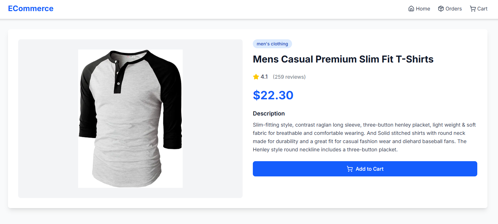
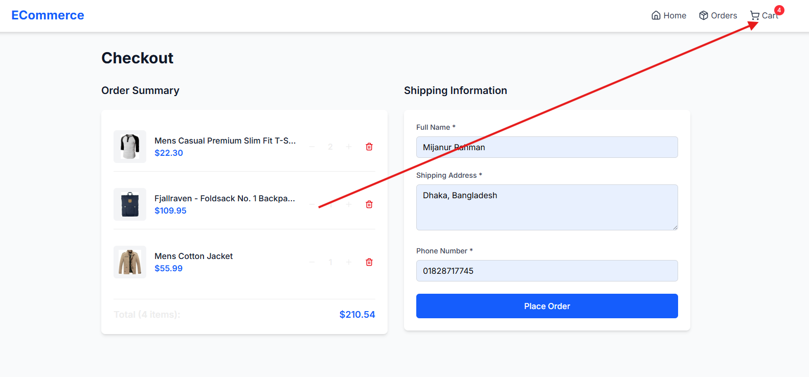
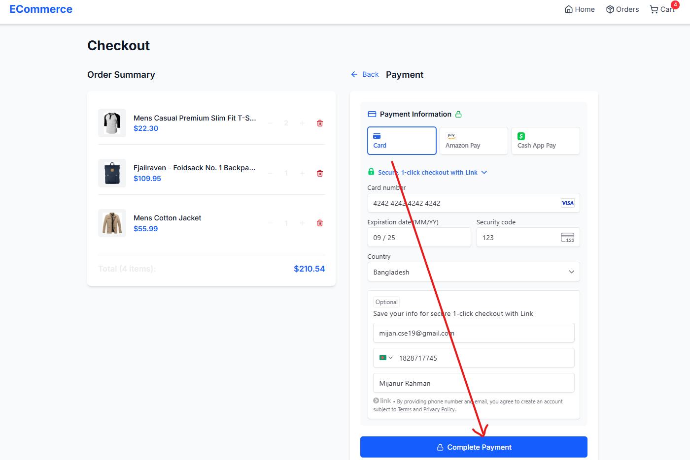
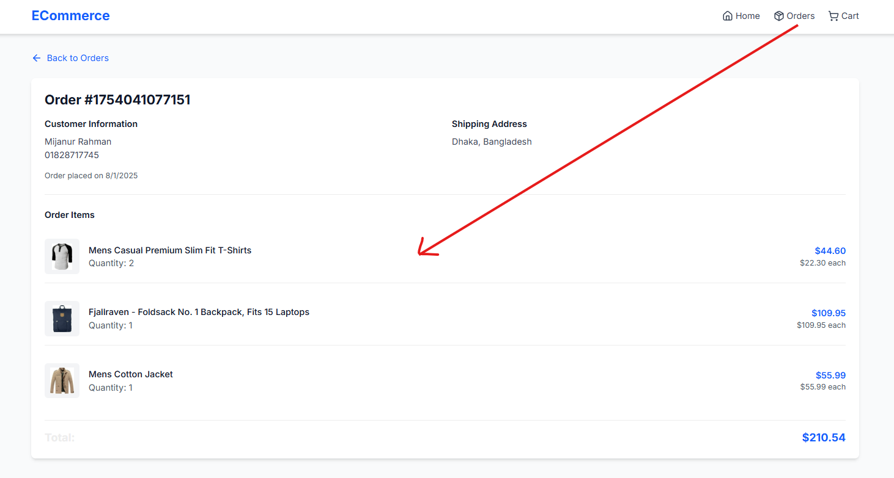

# SEO-Optimized - E-commerce

A modern, fully functional e-commerce frontend built with Next.js, Redux Toolkit, TypeScript, and Tailwind CSS. This application demonstrates best practices for building scalable, SEO-optimized e-commerce applications.

## Features

## ScreenShots

### Core Functionality

-   **Product Catalog**: Browse products fetched from FakeStore API
-   **Product Details**: Detailed product pages with images, descriptions, and ratings
-   **Shopping Cart**: Add, remove, and update product quantities
-   **Checkout Process**: Complete order form with validation
-   **Order Management**: View order history and details
-   **Responsive Design**: Optimized for all device sizes

### Technical Features

-   **Static Site Generation (SSG)**: Pre-rendered product pages for optimal performance
-   **SEO Optimization**: Dynamic meta tags, sitemap, robots.txt
-   **State Management**: Redux Toolkit for cart and order management
-   **Form Validation**: Client-side validation with error handling
-   **TypeScript**: Full type safety throughout the application
-   **Modern UI**: Clean, accessible design with Tailwind CSS

## Tech Stack

-   **Framework**: Next.js 15 (App Router)
-   **State Management**: Redux Toolkit
-   **Styling**: Tailwind CSS
-   **Language**: TypeScript
-   **Icons**: Lucide React
-   **Data Source**: FakeStore API

## Project Structure
<pre>
├── app/
│   ├── layout.tsx               # Root layout with navigation
│   ├── page.tsx                 # Home page with product grid
│   ├── product/[id]/page.tsx    # Dynamic product pages
│   ├── checkout/page.tsx        # Checkout page
│   ├── orders/page.tsx          # Orders history page
│   ├── globals.css              # Global styles
│   ├── robots.txt               # SEO robots file
│   ├── sitemap.ts               # Dynamic sitemap generation
│   └── not-found.tsx            # 404 error page
├── components/
│   ├── Navigation.tsx           # Main navigation component
│   ├── ProductGrid.tsx          # Product listing grid
│   ├── ProductCard.tsx          # Individual product card
│   ├── ProductDetails.tsx       # Product detail view
│   ├── CheckoutPage.tsx         # Checkout page container
│   ├── CheckoutForm.tsx         # Order form with validation
│   ├── CartItem.tsx             # Cart item component
│   ├── OrdersPage.tsx           # Orders page container
│   ├── OrderCard.tsx            # Order summary card
│   ├── OrderDetails.tsx         # Detailed order view
│   └── OrderConfirmation.tsx    # Order success page
├── store/
│   ├── index.ts                 # Redux store configuration
│   ├── cartSlice.ts             # Cart state management
│   └── orderSlice.ts            # Order state management
└── types/
└── product.ts # TypeScript type definitions
</pre>
## Getting Started

### Prerequisites

-   Node.js
-   npm or yarn

### Installation

1. **Clone the repository**
   \`\`\`bash
   git clone https://github.com/Mijan2001/seo-optimized-eCommerce.git
   cd seo-optimized-eCommerce
   \`\`\`

2. **Open your browser**
   Navigate to [http://localhost:3000](http://localhost:3000)

### Build for Production

\`\`\`bash
npm run build
npm start
\`\`\`

## 🔍 SEO Highlights

### Technical SEO

-   **Dynamic Meta Tags**: Each product page has unique title and description
-   **Structured URLs**: Clean, crawlable URLs (/product/1, /orders, etc.)
-   **Sitemap Generation**: Automatic sitemap with all product pages
-   **Robots.txt**: Proper indexing directives
-   **Static Generation**: Pre-rendered pages for better performance

### Content SEO

-   **Semantic HTML**: Proper use of \`<main>\`, \`<section>\`, \`<article>\` tags
-   **Image Optimization**: Alt text for all images, Next.js Image component
-   **Accessibility**: ARIA labels, keyboard navigation, screen reader support
-   **Performance**: Optimized images, code splitting, lazy loading

### Page-Specific SEO

-   **Home Page**: Optimized for "e-commerce" and product category keywords
-   **Product Pages**: Dynamic titles with product names and descriptions
-   **Category Pages**: Structured for product discovery
-   **Privacy Pages**: Checkout and orders pages excluded from indexing

## User Journey

1. **Browse Products**: Users land on the home page and see featured products
2. **View Details**: Click on any product to see detailed information
3. **Add to Cart**: Add desired products with quantity selection
4. **Checkout**: Fill out shipping information with form validation
5. **Order Confirmation**: Receive confirmation with order details
6. **Order History**: View all past orders in the orders section

## Design Features

-   **Responsive Grid**: Products display beautifully on all screen sizes
-   **Interactive Elements**: Hover effects, loading states, and animations
-   **Consistent Branding**: Blue color scheme with professional typography
-   **Accessibility**: High contrast ratios and keyboard navigation
-   **Loading States**: Smooth transitions and feedback for user actions

## Customization

### Adding New Features

-   **Payment Integration**: Add Stripe or PayPal to the checkout process
-   **User Authentication**: Implement login/signup with NextAuth.js
-   **Product Search**: Add search functionality with filters
-   **Wishlist**: Allow users to save products for later
-   **Reviews**: Add product review and rating system

### Styling Customization

-   **Colors**: Modify the color palette in \`tailwind.config.js\`
-   **Typography**: Update font families and sizes
-   **Layout**: Adjust grid layouts and spacing
-   **Components**: Customize individual component styles

-   **Home Page**: Product grid with navigation and hero section
-   **Product Details**: Large product images with detailed information
-   **Shopping Cart**: Clean cart interface with quantity controls
-   **Checkout**: Professional form design with validation
-   **Order History**: Organized list of past purchases

## Contributing

1. Fork the repository
2. Create a feature branch (\`git checkout -b feature/amazing-feature\`)
3. Commit your changes (\`git commit -m 'Add amazing feature'\`)
4. Push to the branch (\`git push origin feature/amazing-feature\`)
5. Open a Pull Request

## Acknowledgments

-   **FakeStore API** for providing the product data
-   **Next.js Team** for the amazing framework
-   **Tailwind CSS** for the utility-first CSS framework
-   **Redux Toolkit** for simplified state management
-   **Lucide React** for the beautiful icons
